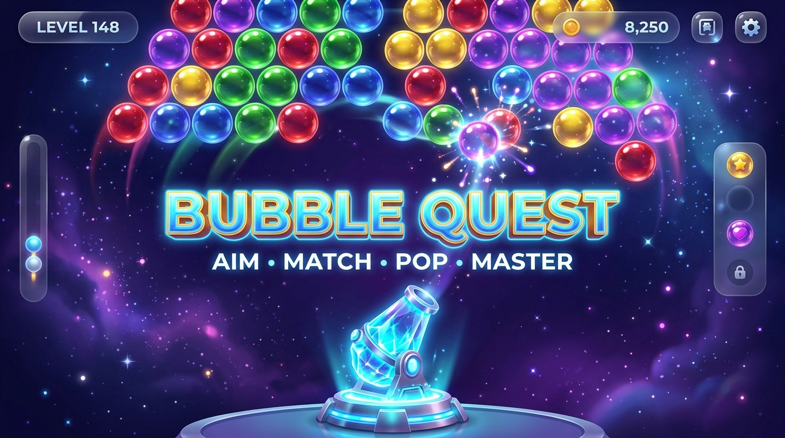
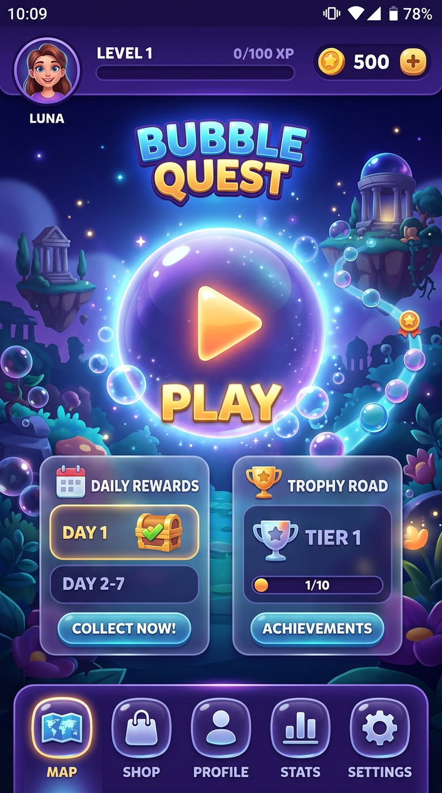
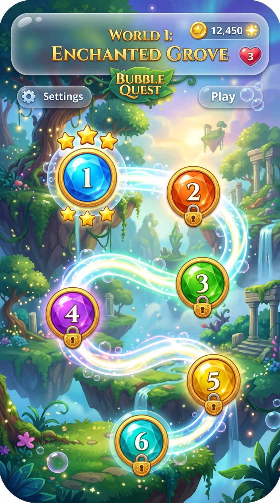
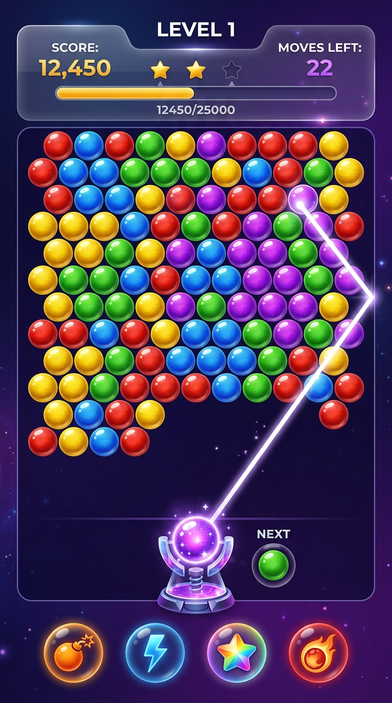
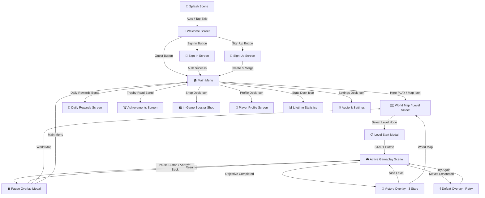

# 🎯 Bubble Quest — Bubble Shooter Saga

<p align="center">
  <strong>Aim • Match • Pop • Master</strong><br>
  A modern, high-performance casual Bubble Shooter mobile and web game built with <strong>Pygame-CE</strong> & <strong>HTML5 Canvas</strong>, featuring glassmorphic Stitch UI, procedural levels, dynamic power-up boosters, and multi-account progression.
</p>

<p align="center">
  
</p>

<p align="center">
  
  
  
  
  
  
</p>

---

## 📑 Table of Contents
- [Overview](#-overview)
- [✨ Key Features](#-key-features)
- [🖼️ Screenshot Gallery](#️-screenshot-gallery)
- [🎮 Gameplay Mechanics](#-gameplay-mechanics)
- [🕹️ How to Play](#️-how-to-play)
- [🗺️ Game Flow & State Architecture](#️-game-flow--state-architecture)
- [📂 Clean Project Structure](#-clean-project-structure)
- [🛠️ Tech Stack](#️-tech-stack)
- [⚙️ Core Systems Breakdown](#️-core-systems-breakdown)
  - [1. Hexagonal Grid & BFS Match Detection](#1-hexagonal-grid--bfs-match-detection)
  - [2. Multi-Source Floating Cluster Dropping](#2-multi-source-floating-cluster-dropping)
  - [3. Power-up Boosters Engine](#3-power-up-boosters-engine)
  - [4. Multi-Account Authentication & Guest Migration](#4-multi-account-authentication--guest-migration)
  - [5. Storage & Schema Sanitization](#5-storage--schema-sanitization)
- [🚀 Installation & Running Locally](#-installation--running-locally)
  - [Python Native Desktop App](#python-native-desktop-app)
  - [Web Browser Single-Page App](#web-browser-single-page-app)
- [📱 Android APK Packaging](#-android-apk-packaging)
- [🌐 Free Cloud Deployment](#-free-cloud-deployment)
  - [Vercel Deployment](#1-vercel-deployment)
  - [GitHub Pages Deployment](#2-github-pages-deployment)
- [🔒 Security & Validation](#-security--validation)
- [⚡ Performance Optimizations](#-performance-optimizations)
- [🧪 Automated Test Suite](#-automated-test-suite)
- [🔧 Troubleshooting](#-troubleshooting)
- [🗺️ Roadmap](#️-roadmap)
- [🤝 Contributing](#-contributing)
- [📄 License](#-license)

---

## 🌟 Overview

**Bubble Quest** is a complete, cross-platform casual arcade game engineered from the ground up to deliver a tactile, responsive experience across desktop, mobile, and web. 

Combining the addictive physics of classic bubble shooters with the modern aesthetics of glassmorphism and 3D skeuomorphic controls, the game offers:
- **Dual-Platform Architecture**: Run natively via Python/Pygame-CE on PC & Android, or play instantly in any web browser via the self-contained Single-Page Web Application.
- **Offline-First & Local-First**: Full guest mode support with zero mandatory external server dependencies.
- **Progressive World Map**: 15 procedural levels across worlds with star ratings, escalating difficulty, and objective-based targets.

---

## ✨ Key Features

- **🎯 Double-Bounce Aiming**: Precise trajectory projection with wall reflection physics.
- **🫧 3D Radial-Gradient Spheres**: High-fidelity procedural rendering with specular highlights and rim lighting.
- **💥 Power-Up Boosters**:
  - 💣 **Bomb**: Clears a 2-radius blast radius.
  - ⚡ **Lightning**: Eliminates an entire horizontal row.
  - 🌈 **Rainbow**: Pops all board bubbles matching the target color.
  - 🔥 **Fireball**: Piercing projectile that burns straight through obstacles.
- **🗺️ Level Progression & World Map**: Curving luminous path connecting gemstone level nodes with star badges and locked states.
- **👤 Multi-Account Profile & Guest System**: Secure local authentication with SHA-256 salted password hashing, automatic guest progress merging, and lifetime statistics tracking.
- **🎁 Daily Rewards & Streak Calendar**: 5-Day claiming cycle with escalating coin gifts.
- **🏆 Trophy Road & Achievements**: Unlockable badges for bubble milestones, combos, and perfect clears.
- **🛍️ In-Game Coin Shop**: Purchase consumable booster items using earned coins.
- **🔊 Procedural Sound Effects & BGM Mixer**: Dynamic pitch-shifted pop sounds with automatic procedural sine-wave audio fallbacks.
- **💾 Corrupt-Resistant Storage**: Atomic JSON save system with strict schema sanitization and boundary clamping.

---

## 🖼️ Screenshot Gallery

<p align="center">
  
  
  
</p>

<p align="center">
  <em>Figure 1: Main Menu Bento Hub, World 1 Map Road, and Real-time Gameplay Canvas HUD.</em>
</p>

---

## 🎮 Gameplay Mechanics

```text
Aim Launcher (Touch / Mouse Drag)
      ↓
Double-Bounce Trajectory Line
      ↓
Release to Shoot Bubble
      ↓
Hexagonal Grid Slot Snapping
      ↓
Breadth-First Search (BFS) Cluster Match Check
      ↓
┌───────────────────────┴───────────────────────┐
│ Match ≥ 3 Bubbles?                            │
│   ├─► YES: Pop Cluster + Play Sound + Sparkles│
│   └─► NO : Stick Bubble to Grid               │
└───────────────────────┬───────────────────────┘
      ↓
Multi-Source Ceiling Flood-Fill
      ↓
Drop Disconnected Floating Clusters (+Bonus Points)
      ↓
Check Win / Defeat Conditions (Target Objective vs. Move Limit)
      ↓
Victory Modal (Stars + Coins) / Try Again Modal
```

---

## 🕹️ How to Play

1. **Select a Level**: Open the World Map and tap the active glowing level node.
2. **Inspect Objectives**: Review the target bubbles and move budget in the Level Start Popup.
3. **Aim**: Click and drag your mouse (or drag your finger on touchscreens) to aim the glowing pointer.
4. **Shoot**: Release to launch the bubble along the guide trajectory.
5. **Match 3+**: Connect 3 or more bubbles of the identical color to pop them.
6. **Trigger Combos**: Popping consecutive clusters escalates the combo multiplier (`x2`, `x3`, `x5`).
7. **Deploy Boosters**: Tap booster icons at the bottom HUD to equip Bomb, Lightning, Rainbow, or Fireball power-ups.
8. **Clear the Objective**: Destroy the required bubbles before your shots run out to earn up to 3 stars!

---

## 🗺️ Game Flow & State Architecture



---

## 📂 Clean Project Structure

```
Python-Bubble-Shooter-game-main/
├── index.html                   # Unified Web Application (all 8 Stitch screens + live game)
├── bubble_shooter_web.html      # Standalone Web mirror
├── main.py                      # Desktop & Android application entry point
├── buildozer.spec               # Android packaging specification
├── vercel.json                  # Cloud static deployment configuration
├── requirements.txt             # Python dependencies
├── pyproject.toml               # Python package metadata
├── save_data.json               # Local multi-account save state
│
├── assets/                      # Runtime assets
│   ├── audio/                   # Background music & sound effects (.ogg)
│   └── images/                  # App icon, splash image, arrow pointer (.png)
│
├── game/                        # Modular Python Game Engine
│   ├── audio/
│   │   └── audio_manager.py     # Procedural sound effects & BGM mixer
│   ├── auth/
│   │   ├── auth_manager.py      # SHA-256 password hashing & salt generation
│   │   ├── session_manager.py   # Multi-account session controller
│   │   └── validators.py        # Input sanitization & regex validators
│   ├── core/
│   │   ├── config.py            # Stitch color tokens, resolution & scaling
│   │   └── scene_manager.py     # Crossfade/slide transitions & back-stack
│   ├── effects/
│   │   └── particles.py         # Confetti bursts & spark particle systems
│   ├── entities/
│   │   ├── bubble.py            # 3D radial-gradient sphere bubbles
│   │   └── launcher.py          # Rotating aiming pedestal & arrow
│   ├── gameplay/
│   │   └── board.py             # Hexagonal grid math & BFS match/drop logic
│   ├── levels/
│   │   ├── level_manager.py     # Level loader & procedural generator
│   │   └── levels.json          # Level layouts, moves, star targets
│   ├── scenes/                  # 15 Complete Screen Implementations
│   │   ├── splash.py, welcome.py, auth_screens.py, main_menu.py
│   │   ├── level_select.py, level_start_popup.py, gameplay.py
│   │   ├── overlays.py, profile.py, shop.py, daily_rewards.py
│   │   ├── achievements.py, statistics.py, settings.py, how_to_play.py
│   ├── storage/
│   │   └── save_manager.py      # Atomic JSON save & schema sanitizer
│   └── ui/
│       ├── design_system.py     # Glassmorphism panels, 3D buttons, progress bars
│       └── widgets.py           # Reusable Label, Button, InputField components
│
├── AndroidBubbleShooter/        # Standalone native Android Gradle wrapper project
├── docs/images/                 # Documentation visual assets & screenshots
└── tests/                       # Automated unit test suite
    ├── test_auth.py             # Auth hashing, validation & session tests
    └── test_gameplay.py         # Hex grid, BFS matching, drop physics & save tests
```

---

## 🛠️ Tech Stack

| Layer | Technology | Details |
|---|---|---|
| **Core Language** | Python 3.7+ / JavaScript (ES6) | Cross-platform desktop & browser engines |
| **Desktop Game Engine** | Pygame-CE (Community Edition) >= 2.5.0 | High-performance SDL2 hardware-accelerated 2D rendering |
| **Web Application** | HTML5 Canvas + Vanilla JS + Tailwind CSS | Zero-dependency standalone SPA |
| **Audio Engine** | Pygame Mixer + Web Audio API | Procedural sound synthesis with dynamic pitch modulation |
| **Mobile Build System**| Buildozer (python-for-android) / Gradle | Android SDK/NDK packaging for API 21–33 |
| **Security & Auth** | Python `hashlib` (SHA-256) + `secrets` | Cryptographically secure salted password verification |
| **Data Storage** | Atomic JSON / `localStorage` | Schema-sanitized local persistence |
| **CI / CD Deployment** | GitHub Actions + Vercel | Automated static site deployments |

---

## ⚙️ Core Systems Breakdown

### 1. Hexagonal Grid & BFS Match Detection
Bubbles reside on an interlocking hexagonal grid where odd rows are indented by half a bubble radius ($R = 18\text{px}$). 

When a bubble snaps to grid position $(r, c)$:
- Adjacent neighbors are calculated using parity-aware offsets:
  - **Even rows**: `[(r, c-1), (r, c+1), (r-1, c-1), (r-1, c), (r+1, c-1), (r+1, c)]`
  - **Odd rows**: `[(r, c-1), (r, c+1), (r-1, c), (r-1, c+1), (r+1, c), (r+1, c+1)]`
- A **Breadth-First Search (BFS)** traverses connected nodes matching the fired bubble's color.
- If $|\text{Cluster}| \ge 3$, all matched bubbles pop, awarding combo score multipliers.

### 2. Multi-Source Floating Cluster Dropping
Any bubbles disconnected from the ceiling row ($r = 0$) after a pop must fall:
1. Multi-source BFS begins with all active bubbles on **Row 0** placed in the `connected` queue.
2. Traversal visits all reachable neighbors and marks them anchored.
3. Any bubble on the board **not visited** is identified as a detached floater.
4. Floaters fall down with gravity physics, awarding escalating point bonuses.

### 3. Power-Up Boosters Engine
- **💣 Bomb**: Performs Manhattan-distance grid search to pop all bubbles within a 2-slot radius.
- **⚡ Lightning**: Traverses columns $0 \le c < \text{cols}$ on the target row and clears all bubbles.
- **🌈 Rainbow**: Identifies the color of the struck bubble and clears all matching bubbles across the entire grid.
- **🔥 Fireball**: Pierces through the projectile's trajectory path regardless of color.

### 4. Multi-Account Authentication & Guest Migration
- **Guest Mode**: Allows instant play without sign-up.
- **Seamless Upgrade**: Registering an account automatically migrates guest level unlocks, high scores, stars, and achievements to the new user profile.
- **Cryptographic Security**: Passwords stored as SHA-256 hashes salted with 16-byte random hex tokens generated via `secrets.token_hex(16)`. Password verification uses constant-time `secrets.compare_digest`.

### 5. Storage & Schema Sanitization
`SaveManager._validate_and_sanitize()` protects save files against corruption:
- Clamps unlocked levels to $[1, \text{total\_levels}]$.
- Clamps star values per level to $[0, 3]$.
- Non-negative clamping on coins and stats metrics.
- Atomic file writes prevent partial file writes during power loss.

---

## 🚀 Installation & Running Locally

### Python Native Desktop App

#### 1. Clone the repository
```bash
git clone https://github.com/luccy93/Bubble-Shooter-Game.git
cd Bubble-Shooter-Game
```

#### 2. Create and activate a virtual environment
```bash
# Windows
python -m venv .venv
.venv\Scripts\activate

# macOS / Linux
python3 -m venv .venv
source .venv/bin/activate
```

#### 3. Install dependencies
```bash
pip install -r requirements.txt
```

#### 4. Run the game
```bash
python main.py
```

---

### Web Browser Single-Page App

You can play the web version without installing any dependencies:

#### Option A: Direct File Open
Simply double-click [`index.html`](file:///c:/Users/Devendraprasad/Downloads/Python-Bubble-Shooter-game-main/index.html) in your file explorer to open it in Chrome, Edge, Safari, or Firefox.

#### Option B: Local HTTP Server
```bash
python -m http.server 8000
```
Open **[http://localhost:8000/index.html](http://localhost:8000/index.html)** in your browser.

---

## 📱 Android APK Packaging

The project includes pre-configured Android build definitions for both Buildozer and Android Studio.

### Building with Buildozer (Linux / WSL2)

```bash
# 1. Install buildozer and dependencies
pip install buildozer cython

# 2. Build debug APK
buildozer android debug

# 3. Deploy and run on connected Android device
buildozer android debug deploy run
```

*The generated `.apk` will be output to `bin/bubbleshooter-1.0.0-debug.apk`.*

---

## 🌐 Free Cloud Deployment

### 1. Vercel Deployment
The repository includes [`vercel.json`](file:///c:/Users/Devendraprasad/Downloads/Python-Bubble-Shooter-game-main/vercel.json) pre-configured for `@vercel/static` zero-config builds:
1. Push this repository to GitHub.
2. Go to **[vercel.com/new](https://vercel.com/new)** and import your repository.
3. Click **Deploy** — Vercel will deploy your live game in ~10 seconds!

### 2. GitHub Pages Deployment
The repository includes an automated GitHub Actions workflow at [`.github/workflows/deploy.yml`](file:///c:/Users/Devendraprasad/Downloads/Python-Bubble-Shooter-game-main/.github/workflows/deploy.yml):
1. In your GitHub repository, go to **Settings ➔ Pages**.
2. Set **Source** to **GitHub Actions**.
3. Push to `main` — your game is live at `https://<username>.github.io/Bubble-Shooter-Game/`!

---

## 🔒 Security & Validation

- **Zero Hardcoded Secrets**: Scanned and verified free of API keys, passwords, or private tokens.
- **No Plaintext Passwords**: All account credentials stored with SHA-256 and unique random cryptographic salts.
- **Strict Input Validation**: Email RFC regex validation and password length enforcement (minimum 6 characters).
- **Safe Path Resolution**: Dynamic relative pathing across all operating systems.

---

## ⚡ Performance Optimizations

- **Surface Caching**: Static background gradients and glassmorphism cards cached in memory to eliminate redundant surface allocations.
- **Particle Culling**: Confetti and spark particles automatically culled upon lifetime expiration to maintain optimal memory usage.
- **Stable 60 FPS**: Fixed time-step clock loop (`pygame.time.Clock().tick(60)`) with delta-time (`dt`) interpolation for smooth projectile motion.

---

## 🧪 Automated Test Suite

The project includes an automated unit test suite covering auth hashing, session migration, board mechanics, level loading, and save sanitization.

Run all unit tests:
```bash
python -m unittest discover -s tests -v
```

**Test Execution Results**:
```
test_email_validation (test_auth.TestAuthSystem) ... ok
test_name_validation (test_auth.TestAuthSystem) ... ok
test_password_hashing (test_auth.TestAuthSystem) ... ok
test_password_validation (test_auth.TestAuthSystem) ... ok
test_session_manager_flow (test_auth.TestAuthSystem) ... ok
test_color_matching_cluster (test_gameplay.TestGameplayMechanics) ... ok
test_floating_clusters_drop (test_gameplay.TestGameplayMechanics) ... ok
test_level_manager_loading (test_gameplay.TestGameplayMechanics) ... ok
test_lightning_row_clear (test_gameplay.TestGameplayMechanics) ... ok
test_neighbors_even_row (test_gameplay.TestGameplayMechanics) ... ok
test_neighbors_odd_row (test_gameplay.TestGameplayMechanics) ... ok
test_save_manager_validation (test_gameplay.TestGameplayMechanics) ... ok
test_special_bubbles_loading (test_gameplay.TestGameplayMechanics) ... ok
----------------------------------------------------------------------
Ran 13 tests in 0.019s

OK (13/13 Passed)
```

---

## 🔧 Troubleshooting

| Issue | Cause | Solution |
|---|---|---|
| `ModuleNotFoundError: No module named 'pygame'` | Pygame is not installed in the active environment | Run `pip install pygame-ce>=2.5.0` |
| `Audio disabled or choppy sound` | System audio mixer unavailable | The game will automatically fall back to procedural sound synthesis |
| `Android build fails on missing Cython` | Outdated Cython version in Buildozer | Run `pip install "cython<3.0.0"` before building with Buildozer |
| `Save file reset to defaults` | `save_data.json` was manually edited with invalid syntax | The `SaveManager` sanitizes and restores valid defaults automatically |

---

## 🗺️ Roadmap

- [x] **Phase 1: Core Physics & Board Engine** (Hexagonal grid, BFS match-3, floating cluster drops)
- [x] **Phase 2: Power-Up Boosters** (Bomb, Lightning, Rainbow, Fireball)
- [x] **Phase 3: Stitch Design System** (Glassmorphism, 3D buttons, responsive layout)
- [x] **Phase 4: Multi-Account Auth & Guest Migration** (SHA-256 salted hashing)
- [x] **Phase 5: Single-Page Web App Integration** (HTML5 Canvas + Tailwind SPA)
- [x] **Phase 6: CI/CD Cloud Deployments** (Vercel static build & GitHub Pages)
- [ ] **Phase 7: Global Leaderboards** (Optional cloud sync)
- [ ] **Phase 8: Additional Worlds & Themed Bubble Sets**

---

## 🤝 Contributing

Contributions, issues, and feature requests are welcome!

1. Fork the Project (`https://github.com/luccy93/Bubble-Shooter-Game/fork`)
2. Create your Feature Branch (`git checkout -b feature/AmazingFeature`)
3. Commit your Changes (`git commit -m 'feat: Add some AmazingFeature'`)
4. Run Unit Tests (`python -m unittest discover -s tests`)
5. Push to the Branch (`git push origin feature/AmazingFeature`)
6. Open a Pull Request

---

## 📄 License

Distributed under the **MIT License**. See `LICENSE` for more information.

---

<p align="center">
  Built with ❤️ using <strong>Pygame-CE</strong> & <strong>HTML5 Canvas</strong>.
</p>
